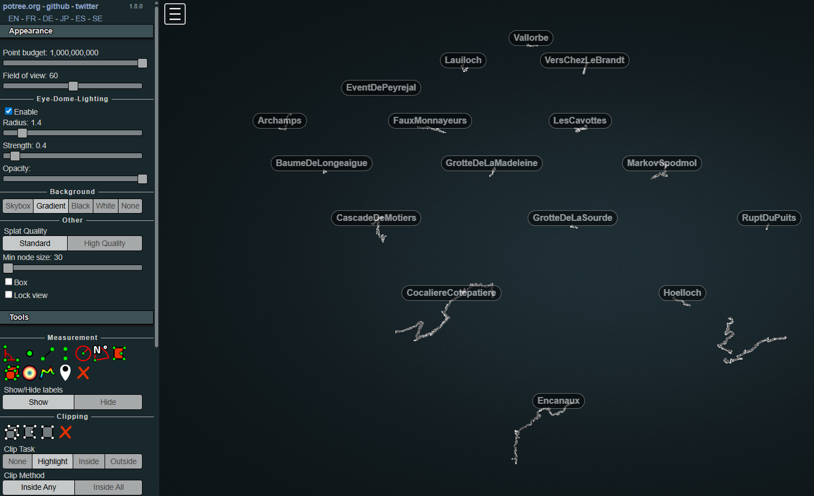

# Karst Conduit Catalogue in Potree

## What this dataset is about

The KarstConduitCatalogue [10.60544/7rk6-rn14](https://doi.org/10.60544/7rk6-rn14) is a dataset encompassing a wide spectrum of hydrologically active cave conduit geometries. High resolution geometric data of cave wall models were acquired by terrestrial and mobile laserscanning methods. Hydrologists may find this dataset suitable for the analysis of key geometric characteristics shaped by typical cave conduits, including along-conduit distributions of aperture and roughness elements.

## Visualisation of the datasets
Point cloud data (in las 1.2 format) was converted to [Potree](http://potree.org/) binary files, allowing for their visualisation on a browser. You can access it by simply clicking below: 

[View the Karst Conduit Catalogue here](https://tr1813.github.io/karstconduitcatalogue-potree/DataPaper.html) 

 _Potree Visualisation of the Karst Conduit Catalogue_

## Copyright and license
This dataset is licensed under a Creative Commons Attribution Non Commercial 4.0 International

## Funding
The authors of this dataset acknowledge funding by the European Union (ERC Karst, 101071836). Views and opinions expressed are however those of the authors only and do not necessarily reflect those of the European Union or the European Research Council Executive Agency. Neither the European Union nor the granting authority can be held responsible for them.
